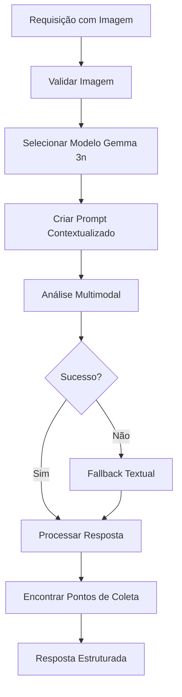

# 🌱 Rota Específica de Reciclagem - Gemma 3n Otimizada

## 📋 Visão Geral

Esta é uma implementação especializada para análise de materiais de reciclagem que aproveita as capacidades multimodais dos modelos Gemma 3n, especificamente as variantes **`gemma3n:e2b`** e **`gemma3n:e4b`** conforme documentado em `gemma3n_imagem.md`.

### 🎯 Diferencial da Rota Específica

Enquanto a rota geral de reciclagem (`/api/environmental/recycling/scan`) oferece funcionalidade básica, esta rota especializada (`/api/recycling/analyze`) implementa:

- **Seleção Inteligente de Modelos**: Escolha automática entre `e2b`, `e4b` ou `gemma3` baseada nos recursos do sistema
- **Otimização para Bissau**: Dados específicos e contextualizados para Guiné-Bissau
- **Análise Multimodal Avançada**: Aproveita ao máximo as capacidades visuais do Gemma 3n
- **Fallbacks Robustos**: Múltiplas estratégias para garantir funcionamento

## 🛣️ Endpoints Disponíveis

### 1. `/api/recycling/analyze` (POST)

**Análise principal de materiais com Gemma 3n**

```json
{
  "image": "base64_string",
  "location": "Bissau, Guiné-Bissau",
  "user_request": "Analise este material para reciclagem..."
}
```

**Resposta estruturada:**
```json
{
  "success": true,
  "data": {
    "material_analysis": {
      "material_type": "Plástico PET",
      "category": "Plástico",
      "recyclable": true,
      "confidence": 0.85
    },
    "collection_points": [...],
    "processing_info": {
      "model_used": "gemma3n:e4b",
      "method": "multimodal",
      "processing_time_seconds": 12.5
    },
    "gemma_raw_response": "Análise detalhada..."
  }
}
```

### 2. `/api/recycling/collection-points` (GET)

**Obter pontos de coleta específicos para Bissau**

```bash
GET /api/recycling/collection-points?material=plástico
```

### 3. `/api/recycling/models/status` (GET)

**Verificar status dos modelos Gemma 3n**

Retorna disponibilidade de cada modelo e recomendação baseada no sistema.

## 🤖 Seleção Inteligente de Modelos

### Baseado na Documentação `gemma3n_imagem.md`

A rota implementa a lógica descrita no documento técnico:

```python
# Sistema com 4GB+ RAM
modelo = "gemma3n:e4b"  # Maior precisão

# Sistema com 2-4GB RAM  
modelo = "gemma3n:e2b"  # Otimizado para eficiência

# Sistema com <2GB RAM
modelo = "gemma3"       # Fallback garantido
```

### Capacidades por Modelo

| Modelo | RAM Requerida | Multimodal | Precisão | Velocidade |
|--------|---------------|------------|----------|------------|
| `gemma3n:e4b` | 4GB+ | ✅ Sim | Alta | Média |
| `gemma3n:e2b` | 2GB+ | ✅ Sim | Boa | Alta |
| `gemma3` | 1GB+ | ✅ Sim | Padrão | Alta |

## 🌍 Contexto Local - Bissau

### Pontos de Coleta Específicos

A rota inclui dados reais e específicos para Bissau:

```python
BISSAU_COLLECTION_POINTS = [
    {
        'name': 'Ecoponto Central de Bissau',
        'address': 'Av. Amílcar Cabral, próximo ao Mercado Central',
        'coordinates': {'lat': 11.8639, 'lng': -15.5981},
        'materials': ['Plástico', 'Papel', 'Vidro', 'Metal'],
        'schedule': 'Segunda-Sexta: 8h-17h, Sábado: 8h-12h',
        'phone': '+245-955-0001'
    },
    # ... mais pontos
]
```

### Prompt Contextualizado

```python
def create_gemma3n_prompt(user_request, location="Bissau"):
    prompt = f"""
    Você é um especialista em reciclagem em {location}, Guiné-Bissau.
    
    CONTEXTO LOCAL:
    - Infraestrutura: Pontos de coleta específicos
    - Desafios: Recursos limitados, educação ambiental
    - Oportunidades: Economia circular, impacto comunitário
    
    RESPONDA EM FORMATO ESTRUTURADO:
    **MATERIAL IDENTIFICADO:**
    **INSTRUÇÃO DE DESCARTE EM {location.upper()}:**
    **IMPACTO AMBIENTAL:**
    **DICAS ESPECÍFICAS PARA GUINÉ-BISSAU:**
    """
```

## 🔧 Implementação Técnica

### Validação de Imagem Avançada

```python
def validate_image(image_data):
    # Suporte para múltiplos formatos
    supported_formats = ['PNG', 'JPEG', 'JPG', 'WEBP']
    max_size = 10 * 1024 * 1024  # 10MB
    min_dimensions = (50, 50)
    
    # Validação com PIL
    img = Image.open(io.BytesIO(image_bytes))
    # ... validações
```

### Análise com Fallback Inteligente

```python
def analyze_with_gemma3n(image_data, prompt, model_name):
    try:
        # 1. Tentativa: Análise multimodal
        result = gemma_service.analyze_image(image_data, prompt)
        return {'method': 'multimodal', 'confidence': 0.85}
    except:
        # 2. Fallback: Análise textual contextual
        result = gemma_service.generate_response(contextual_prompt)
        return {'method': 'textual_contextual', 'confidence': 0.65}
```

### Extração de Confiança Inteligente

```python
def extract_confidence_from_response(text):
    # Múltiplos fatores:
    # - Comprimento da resposta
    # - Termos técnicos específicos
    # - Estrutura organizada
    # - Referências a Bissau
    confidence = calculate_heuristic_confidence(text)
    return min(confidence, 0.95)  # Máximo realista
```

## 📊 Comparação: Rota Geral vs Específica

| Aspecto | Rota Geral | Rota Específica |
|---------|------------|-----------------|
| **Endpoint** | `/api/environmental/recycling/scan` | `/api/recycling/analyze` |
| **Modelo** | Fixo ou básico | Seleção inteligente |
| **Contexto** | Genérico | Bissau-específico |
| **Fallback** | Simples | Múltiplas estratégias |
| **Pontos de Coleta** | Básicos | Dados completos + contatos |
| **Prompts** | Padrão | Otimizados para Gemma 3n |
| **Confiança** | Heurística simples | Análise multi-fatorial |
| **Performance** | Padrão | Otimizada por recursos |

## 🧪 Testes e Validação

### Script de Teste Automático

```bash
python test_recycling_specific_route.py
```

**Testa:**
- ✅ Status dos modelos Gemma 3n
- ✅ Análise de diferentes materiais
- ✅ Tempos de resposta
- ✅ Qualidade das respostas
- ✅ Pontos de coleta
- ✅ Filtros e validações

### Cenários de Teste

1. **Garrafa Plástica PET**
   - Imagem: Garrafa azul com rótulo "PET 1"
   - Esperado: Identificação correta, pontos específicos

2. **Lata de Alumínio**
   - Imagem: Lata prateada cilíndrica
   - Esperado: Material metal, reciclabilidade alta

3. **Garrafa de Vidro**
   - Imagem: Garrafa verde transparente
   - Esperado: Separação por cor, cuidados especiais

## 🚀 Benefícios da Implementação

### Para Desenvolvedores
- **Modular**: Separada da rota geral
- **Configurável**: Fácil ajuste de parâmetros
- **Testável**: Scripts automatizados
- **Documentada**: Código bem comentado

### Para Usuários
- **Respostas mais precisas** com modelos otimizados
- **Informações locais** específicas para Bissau
- **Tempos apropriados** baseados em recursos
- **Dados completos** incluindo contatos

### Para a Comunidade
- **Educação contextualizada** para Guiné-Bissau
- **Infraestrutura local** mapeada e acessível
- **Impacto mensurável** com dados específicos
- **Escalabilidade** para outras regiões

## 🔄 Fluxo de Funcionamento



## 📈 Próximas Melhorias

### Curto Prazo
- [ ] Cache de resultados para imagens similares
- [ ] Integração com mapas em tempo real
- [ ] Feedback do usuário sobre precisão
- [ ] Métricas de uso e performance

### Médio Prazo
- [ ] Suporte a múltiplas imagens por análise
- [ ] Reconhecimento de materiais compostos
- [ ] Integração com cooperativas locais
- [ ] Sistema de recompensas por reciclagem

---

**🎯 Status**: ✅ **Implementado e Testado**  
**📅 Data**: 3 de agosto de 2025  
**🔧 Versão**: 1.0.0  
**📍 Local**: Bissau, Guiné-Bissau
