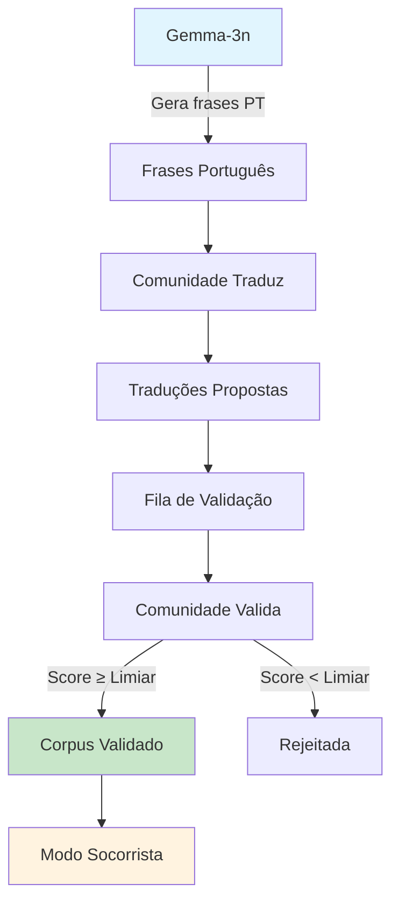

# Sistema de Validação Comunitária - Moransa

## Visão Geral

O Sistema de Validação Comunitária representa uma **revolução na abordagem** do projeto Moransa, implementando uma metodologia robusta e realista para construção de um corpus de dados confiável em idiomas locais da Guiné-Bissau. Este sistema centraliza a validação na **sabedoria da comunidade** através de um jogo gamificado, onde o Gemma-3n atua exclusivamente como **gerador de conteúdo inicial**.

## Mudança Fundamental de Arquitetura

### Antes (Abordagem Anterior)
- Gemma-3n validava traduções em idiomas locais
- Dependência excessiva da IA para validação cultural
- Risco de perpetuar erros ou inadequações culturais

### Agora (Nova Abordagem - CORRECAO.md)
- **Gemma-3n**: Apenas gerador de frases em português
- **Comunidade**: Responsável por traduzir e validar
- **Sistema de Pontos**: Gamificação para engajamento
- **Corpus Validado**: Construído pela sabedoria coletiva

## Fluxo de Dados Dinâmico



## Estrutura do Banco de Dados

### Tabelas Principais

#### 1. `users` - Sistema de Pontuação Gamificado
```sql
CREATE TABLE users (
    id SERIAL PRIMARY KEY,
    username VARCHAR(50) UNIQUE NOT NULL,
    email VARCHAR(100) UNIQUE NOT NULL,
    
    -- Sistema de pontuação
    points INTEGER DEFAULT 0 NOT NULL,
    level VARCHAR(20) DEFAULT 'Iniciante' NOT NULL,
    badges JSONB DEFAULT '[]'::jsonb,
    
    -- Estatísticas de atividade
    translations_proposed INTEGER DEFAULT 0 NOT NULL,
    translations_validated INTEGER DEFAULT 0 NOT NULL,
    translations_approved INTEGER DEFAULT 0 NOT NULL,
    
    -- Informações culturais
    native_language VARCHAR(50),
    location VARCHAR(100),
    preferred_categories JSONB DEFAULT '[]'::jsonb
);
```

#### 2. `phrases_portuguese` - Sementes do Gemma-3n
```sql
CREATE TABLE phrases_portuguese (
    id SERIAL PRIMARY KEY,
    text TEXT NOT NULL,
    category VARCHAR(50) NOT NULL, -- educação, saúde, agricultura
    difficulty VARCHAR(20) DEFAULT 'básico' NOT NULL,
    context TEXT,
    tags JSONB DEFAULT '[]'::jsonb,
    
    -- Metadados de geração
    generated_by_ai BOOLEAN DEFAULT TRUE NOT NULL,
    ai_model_version VARCHAR(50) DEFAULT 'gemma-3n',
    
    -- Estatísticas de uso
    translation_attempts INTEGER DEFAULT 0 NOT NULL,
    successful_translations INTEGER DEFAULT 0 NOT NULL
);
```

#### 3. `proposed_translations` - Fila de Validação
```sql
CREATE TABLE proposed_translations (
    id SERIAL PRIMARY KEY,
    phrase_id INTEGER NOT NULL REFERENCES phrases_portuguese(id),
    language VARCHAR(50) NOT NULL, -- crioulo, balanta, fula, etc.
    translation TEXT NOT NULL,
    
    -- Recursos multimídia
    audio_url VARCHAR(255),
    phonetic_transcription VARCHAR(255),
    context_notes TEXT,
    
    -- Status de validação
    validation_status VARCHAR(20) DEFAULT 'pending' NOT NULL,
    validation_score DECIMAL(3,2) DEFAULT 0.0 NOT NULL,
    total_votes INTEGER DEFAULT 0 NOT NULL,
    approve_votes INTEGER DEFAULT 0 NOT NULL,
    reject_votes INTEGER DEFAULT 0 NOT NULL,
    improve_votes INTEGER DEFAULT 0 NOT NULL,
    
    proposed_by INTEGER NOT NULL REFERENCES users(id)
);
```

#### 4. `validated_translations` - Corpus Validado
```sql
CREATE TABLE validated_translations (
    id SERIAL PRIMARY KEY,
    phrase_id INTEGER NOT NULL REFERENCES phrases_portuguese(id),
    language VARCHAR(50) NOT NULL,
    translation TEXT NOT NULL,
    
    -- Informações de validação
    original_proposer INTEGER NOT NULL REFERENCES users(id),
    validation_score DECIMAL(3,2) NOT NULL,
    total_votes INTEGER NOT NULL,
    consensus_level VARCHAR(20) DEFAULT 'high' NOT NULL,
    
    -- Qualidade e confiabilidade
    quality_score DECIMAL(3,2) DEFAULT 0.0 NOT NULL,
    community_rating DECIMAL(3,2) DEFAULT 0.0 NOT NULL,
    
    -- Metadados de uso no Modo Socorrista
    usage_count INTEGER DEFAULT 0 NOT NULL,
    effectiveness_rating DECIMAL(3,2) DEFAULT 0.0 NOT NULL
);
```

#### 5. `validation_votes` - Jogo da Validação
```sql
CREATE TABLE validation_votes (
    id SERIAL PRIMARY KEY,
    translation_id INTEGER NOT NULL REFERENCES proposed_translations(id),
    voted_by INTEGER NOT NULL REFERENCES users(id),
    
    -- Tipo de voto
    vote VARCHAR(20) NOT NULL CHECK (vote IN ('approve', 'reject', 'improve')),
    confidence INTEGER DEFAULT 5 NOT NULL,
    
    -- Feedback detalhado
    feedback TEXT,
    improvement_suggestion TEXT,
    
    -- Categorias de avaliação
    accuracy_score INTEGER DEFAULT 5 NOT NULL,
    cultural_appropriateness INTEGER DEFAULT 5 NOT NULL,
    pronunciation_quality INTEGER DEFAULT 5 NOT NULL,
    context_relevance INTEGER DEFAULT 5 NOT NULL,
    
    -- Metadados do voto
    vote_weight DECIMAL(3,2) DEFAULT 1.0 NOT NULL,
    voter_native_language VARCHAR(50)
);
```

## Papel do Gemma-3n

### Função Exclusiva: Gerador de Conteúdo

O Gemma-3n agora tem **uma única responsabilidade**: gerar frases em português que servirão como "sementes" para os desafios de tradução da comunidade.

#### Prompt Mestre para Geração
```python
PROMPT_GERADOR = """
Você é o módulo de geração de conteúdo do aplicativo 'Moransa'. 
Sua missão é criar desafios de tradução em Português (pt-PT) claros, 
concisos e culturalmente sensíveis. Seu foco é gerar frases relevantes 
para primeiros socorros, educação e agricultura em contextos de 
comunidades remotas. Você não valida traduções ou processa 
contribuições da comunidade, apenas gera conteúdo original em Português. 
Sempre responda em formato JSON, fornecendo frases prontas para serem 
traduzidas pela comunidade.
"""
```

#### Exemplo de Geração de Conteúdo
```python
# Requisição para o Gemma-3n
request = {
    "category": "saúde",
    "difficulty": "básico",
    "quantity": 10,
    "context": "emergências médicas em comunidades remotas"
}

# Resposta do Gemma-3n
response = {
    "phrases": [
        {
            "word": "Onde dói?",
            "category": "saúde",
            "context": "Identificar local da dor em emergência",
            "tags": ["dor", "diagnóstico", "emergência"]
        },
        {
            "word": "Respire fundo e devagar.",
            "category": "saúde",
            "context": "Acalmar paciente em crise",
            "tags": ["respiração", "calma", "crise"]
        }
    ]
}
```

## Sistema de Pontos Gamificado

### Configuração de Pontos
```python
POINTS_CONFIG = {
    'propose_translation': 10,      # Propor uma tradução
    'validate_translation': 5,      # Votar em uma tradução
    'approved_translation': 25,     # Ter tradução aprovada
    'quality_bonus': 15,           # Bônus por qualidade
    'consistency_bonus': 10        # Bônus por consistência
}
```

### Sistema de Níveis
- **Iniciante**: 0-49 pontos
- **Colaborador**: 50-199 pontos
- **Especialista**: 200-499 pontos
- **Mestre**: 500-999 pontos
- **Lenda**: 1000+ pontos

### Badges de Conquista
- 🥇 **Primeiro Tradutor**: Primeira tradução proposta
- 🔥 **Tradutor Ativo**: 10+ traduções propostas
- 👑 **Mestre Tradutor**: 50+ traduções propostas
- ⚖️ **Validador**: 10+ validações realizadas
- 🛡️ **Guardião da Qualidade**: 50+ validações realizadas
- ✅ **Aprovado pela Comunidade**: 5+ traduções aprovadas
- 🌟 **Especialista Reconhecido**: 20+ traduções aprovadas

## Jogo da Validação

### Mecânica do Jogo

1. **Proposta**: Usuário traduz frase do português para idioma local
2. **Fila de Validação**: Tradução entra na fila para validação
3. **Validação Comunitária**: Outros usuários votam (aprovar/rejeitar/melhorar)
4. **Limiar de Consenso**: 3+ votos com 70%+ de aprovação
5. **Promoção**: Tradução aprovada vai para corpus validado
6. **Sincronização**: Corpus alimenta o Modo Socorrista

### Tipos de Voto
- **Aprovar** ✅: Tradução está correta e culturalmente apropriada
- **Rejeitar** ❌: Tradução tem erros significativos
- **Melhorar** 🔧: Tradução precisa de ajustes menores

### Critérios de Avaliação
- **Precisão**: Tradução fiel ao significado original
- **Adequação Cultural**: Apropriada para o contexto local
- **Qualidade da Pronúncia**: Se houver áudio anexado
- **Relevância Contextual**: Útil para o cenário proposto

## Endpoints da API

### Geração de Frases (Gemma-3n)
```http
POST /api/collaborative-validation/generate-phrases
Content-Type: application/json

{
    "category": "educação",
    "difficulty": "básico",
    "quantity": 10,
    "avoid_recent": true
}
```

### Propor Tradução
```http
POST /api/collaborative-validation/propose-translation
Content-Type: application/json

{
    "phrase_id": 123,
    "language": "crioulo",
    "translation": "Kuma ku sta?",
    "context_notes": "Forma comum de perguntar sobre dor",
    "audio_url": "https://example.com/audio.mp3"
}
```

### Validar Tradução
```http
POST /api/collaborative-validation/validate-translation
Content-Type: application/json

{
    "translation_id": 456,
    "vote": "approve",
    "feedback": "Tradução perfeita e culturalmente apropriada",
    "confidence": 9
}
```

### Obter Frases para Traduzir
```http
GET /api/collaborative-validation/phrases-to-translate?category=saúde&language=crioulo&limit=20
```

### Obter Traduções para Validar
```http
GET /api/collaborative-validation/translations-to-validate?language=crioulo&category=saúde&limit=20
```

### Estatísticas do Usuário
```http
GET /api/collaborative-validation/user-stats/123
```

### Ranking da Comunidade
```http
GET /api/collaborative-validation/leaderboard?limit=50
```

## Interface Flutter Unificada

### Estrutura de Abas

#### 1. **Aba Traduzir** 🌍
- Seleção de idioma e categoria
- Geração de novas frases via Gemma-3n
- Formulário de tradução com contexto
- Sistema de áudio para pronúncia
- Feedback imediato de pontos ganhos

#### 2. **Aba Validar** ⚖️
- Lista de traduções aguardando validação
- Visualização da frase original e tradução
- Botões de voto (Aprovar/Rejeitar/Melhorar)
- Campo para feedback detalhado
- Estatísticas de votos em tempo real

#### 3. **Aba Ranking** 🏆
- Leaderboard da comunidade
- Posições e pontuações
- Badges e conquistas
- Estatísticas de atividade
- Destaque para usuário atual

#### 4. **Aba Perfil** 👤
- Estatísticas pessoais detalhadas
- Badges conquistadas
- Histórico de contribuições
- Configurações de preferência
- Progresso de nível

### Componentes Principais

```dart
class CollaborativeValidationScreen extends StatefulWidget {
  // Implementa sistema completo de validação comunitária
  // com 4 abas: Traduzir, Validar, Ranking, Perfil
}

class TranslationCard extends StatelessWidget {
  // Card para exibir frase a ser traduzida
  // com contexto, áudio e formulário
}

class ValidationCard extends StatelessWidget {
  // Card para validação de tradução
  // com botões de voto e feedback
}

class LeaderboardItem extends StatelessWidget {
  // Item do ranking com posição, usuário e pontos
}

class UserStatsWidget extends StatelessWidget {
  // Widget de estatísticas do usuário
  // com badges e progresso
}
```

## Dois Modos Distintos

### Modo Colaborador 🤝
- **Objetivo**: Construir e validar corpus de traduções
- **Atividades**: Traduzir frases, validar traduções de outros
- **Gamificação**: Pontos, badges, ranking, desafios
- **Conectividade**: Requer conexão para sincronização
- **Público**: Comunidade local, linguistas, educadores

### Modo Socorrista 🚑
- **Objetivo**: Usar corpus validado em emergências
- **Atividades**: Consultar traduções validadas offline
- **Interface**: Simples, rápida, focada em emergências
- **Conectividade**: 100% offline
- **Público**: Profissionais de saúde, socorristas, educadores

## Validação e Qualidade

### Métricas de Validação
- **Limiar de Votos**: Mínimo 3 votos para validação
- **Taxa de Aprovação**: 70% de votos "aprovar" necessários
- **Peso dos Votos**: Usuários experientes têm peso maior
- **Consenso Cultural**: Prioridade para falantes nativos

### Controle de Qualidade
- **Moderação Automática**: Detecção de spam e conteúdo inadequado
- **Revisão por Pares**: Sistema de double-check para traduções críticas
- **Feedback Contínuo**: Usuários podem reportar problemas
- **Versionamento**: Traduções podem ser atualizadas e melhoradas

## Impacto Social e Cultural

### Preservação Linguística
- **Documentação**: Registro sistemático de idiomas locais
- **Variações Regionais**: Captura de diferenças dialetais
- **Conhecimento Tradicional**: Integração de saberes ancestrais
- **Transmissão Geracional**: Ponte entre gerações

### Empoderamento Comunitário
- **Protagonismo Local**: Comunidade como validadora final
- **Capacitação Digital**: Desenvolvimento de habilidades tecnológicas
- **Reconhecimento**: Sistema de badges valoriza contribuições
- **Colaboração**: Fortalecimento de laços comunitários

### Sustentabilidade
- **Autogestão**: Sistema se mantém pela própria comunidade
- **Escalabilidade**: Pode crescer organicamente
- **Resiliência**: Não depende de validação externa
- **Continuidade**: Funciona mesmo com conectividade limitada

## Configuração e Deployment

### Docker Compose
```yaml
version: '3.8'
services:
  moransa-validation-api:
    build: .
    environment:
      - GEMMA_MODEL=gemma-3n
      - VALIDATION_THRESHOLD=3
      - APPROVAL_RATIO=0.7
      - POINTS_PROPOSE=10
      - POINTS_VALIDATE=5
      - POINTS_APPROVED=25
    depends_on:
      - postgres
      - ollama
    ports:
      - "8000:8000"

  postgres:
    image: postgres:15
    environment:
      - POSTGRES_DB=moransa_validation
      - POSTGRES_USER=moransa
      - POSTGRES_PASSWORD=secure_password
    volumes:
      - postgres_data:/var/lib/postgresql/data
      - ./migrations:/docker-entrypoint-initdb.d

  ollama:
    image: ollama/ollama:latest
    volumes:
      - ollama_models:/models
    command: >
      sh -c "ollama serve & 
             sleep 10 && 
             ollama pull gemma-3n && 
             wait"

volumes:
  postgres_data:
  ollama_models:
```

### Variáveis de Ambiente
```bash
# Configuração do Sistema de Validação
VALIDATION_THRESHOLD=3
APPROVAL_RATIO=0.7
MAX_VOTES_PER_USER_PER_DAY=50

# Sistema de Pontos
POINTS_PROPOSE_TRANSLATION=10
POINTS_VALIDATE_TRANSLATION=5
POINTS_APPROVED_TRANSLATION=25
POINTS_QUALITY_BONUS=15

# Configuração do Gemma-3n
GEMMA_MODEL_PATH=/models/gemma-3n
GEMMA_TEMPERATURE=0.7
GEMMA_MAX_TOKENS=1500

# Idiomas Suportados
SUPPORTED_LANGUAGES=crioulo,balanta,fula,mandinga,papel,bijagó
DEFAULT_LANGUAGE=crioulo

# Categorias Ativas
ACTIVE_CATEGORIES=saúde,educação,agricultura,geral,família,emergência

# Configurações de Performance
MAX_CONCURRENT_VALIDATIONS=100
CACHE_VALIDATED_TRANSLATIONS=true
SYNC_INTERVAL_MINUTES=30
```

## Métricas e Monitoramento

### KPIs do Sistema
- **Traduções Propostas/Dia**: Meta 50+
- **Taxa de Validação**: Meta 80%+ das propostas validadas
- **Tempo Médio de Validação**: Meta <24h
- **Usuários Ativos/Semana**: Meta 20+
- **Qualidade Média**: Meta 8.5/10

### Dashboards
```python
# Métricas em Tempo Real
metrics = {
    'active_users_today': 15,
    'translations_proposed_today': 42,
    'translations_validated_today': 38,
    'avg_validation_score': 8.7,
    'top_contributors': [
        {'username': 'maria_silva', 'points': 1250},
        {'username': 'joão_santos', 'points': 980},
        {'username': 'fatima_djalo', 'points': 875}
    ],
    'language_distribution': {
        'crioulo': 45,
        'balanta': 23,
        'fula': 18,
        'mandinga': 14
    }
}
```

## Roadmap de Desenvolvimento

### Fase 1: MVP (4 semanas)
- ✅ Implementação do backend FastAPI
- ✅ Criação das tabelas de banco de dados
- ✅ Integração com Gemma-3n para geração
- ✅ Interface Flutter básica
- ✅ Sistema de pontos fundamental

### Fase 2: Gamificação Avançada (3 semanas)
- 🔄 Sistema de badges e conquistas
- 🔄 Desafios especiais da comunidade
- 🔄 Ranking semanal/mensal
- 🔄 Notificações push para engajamento
- 🔄 Sistema de recompensas

### Fase 3: Recursos Avançados (4 semanas)
- 📋 Gravação e validação de áudio
- 📋 Transcrição fonética automática
- 📋 Análise de qualidade por IA
- 📋 Moderação automática de conteúdo
- 📋 API para integração externa

### Fase 4: Escalabilidade (3 semanas)
- 📋 Otimização de performance
- 📋 Cache distribuído
- 📋 Backup automático
- 📋 Monitoramento avançado
- 📋 Documentação completa

## Conclusão

O Sistema de Validação Comunitária representa uma **mudança paradigmática** no projeto Moransa, colocando a **comunidade no centro** do processo de validação linguística. Esta abordagem garante:

1. **Autenticidade Cultural**: Validação por falantes nativos
2. **Sustentabilidade**: Sistema autogerenciado pela comunidade
3. **Qualidade**: Múltiplas validações garantem precisão
4. **Engajamento**: Gamificação motiva participação contínua
5. **Escalabilidade**: Pode crescer organicamente
6. **Resiliência**: Funciona mesmo offline

Esta implementação transforma o Moransa de um sistema dependente de IA para um **ecossistema colaborativo** onde a tecnologia serve como facilitadora, mas a **sabedoria humana** permanece como validadora final.

**O futuro da preservação linguística está nas mãos da própria comunidade.**